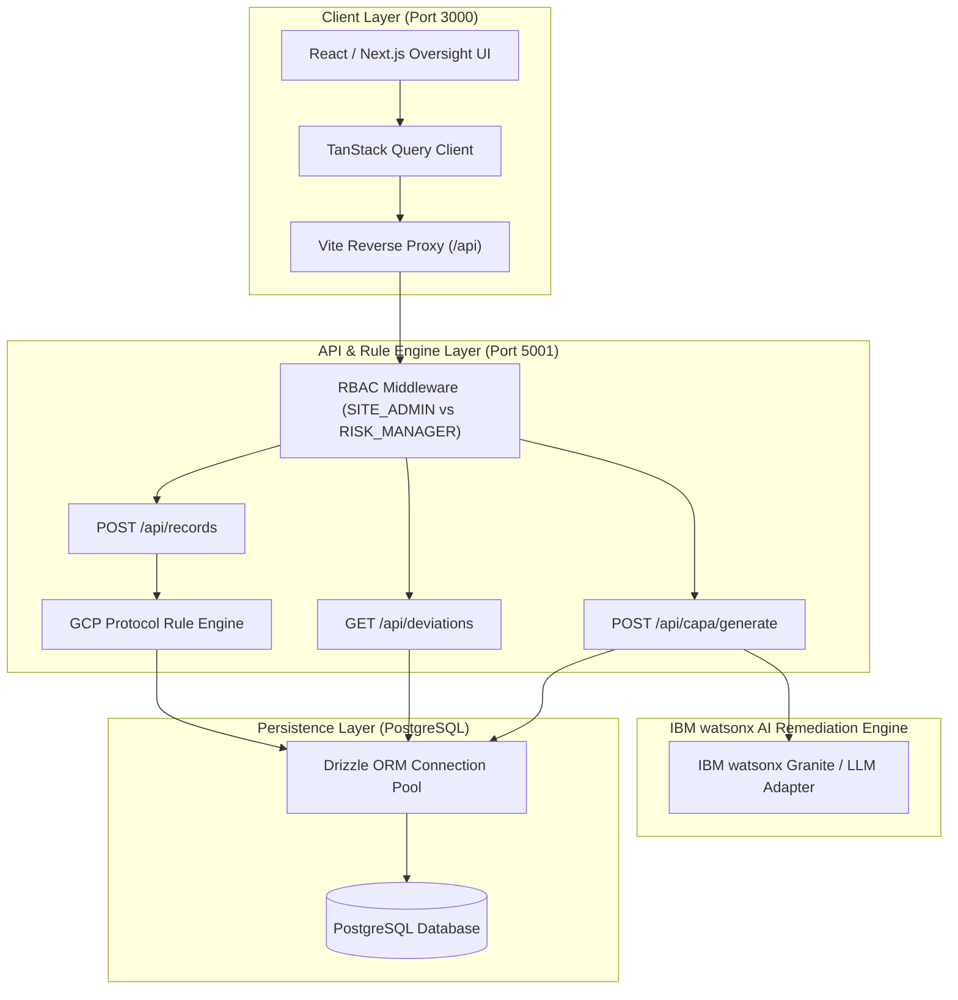
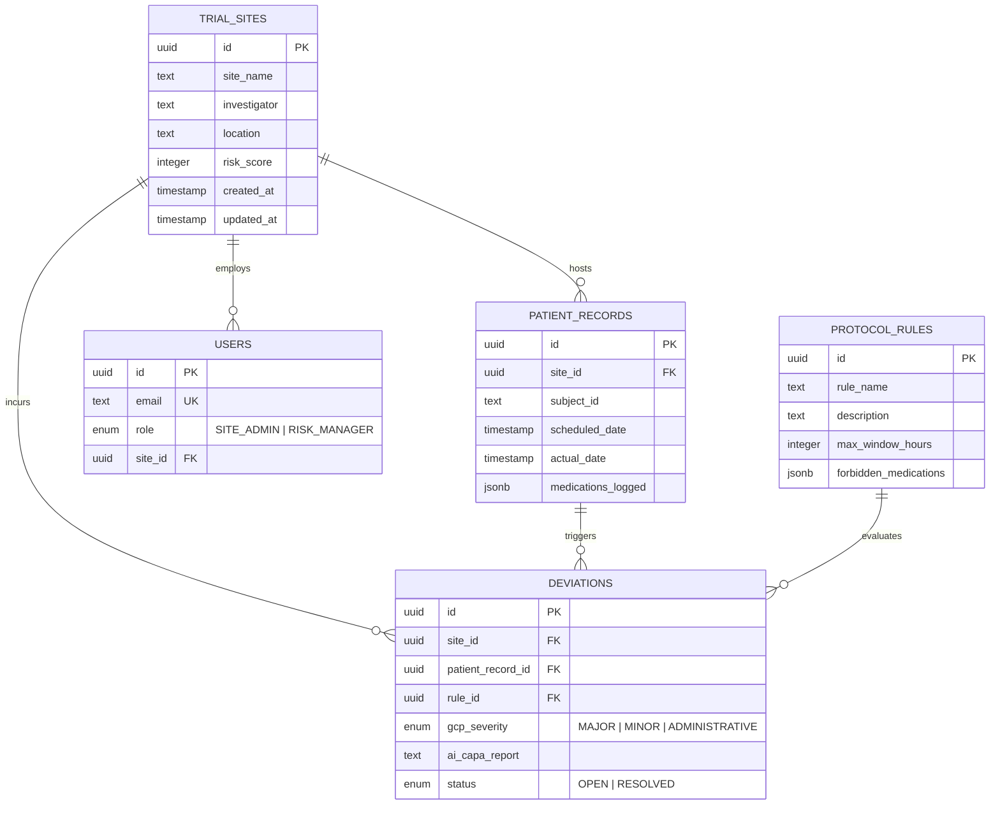
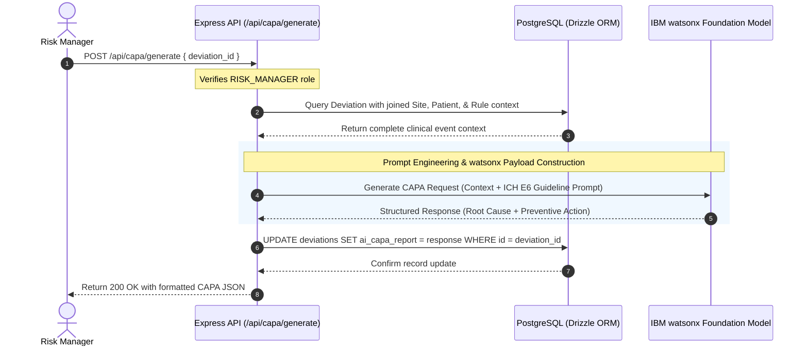

# AegisTrial GCP Copilot — Technical Architecture

AegisTrial GCP Copilot is an enterprise-grade clinical oversight platform designed to ensure Good Clinical Practice (ICH E6 GCP) compliance across multi-center clinical trials. The platform automates protocol deviation detection, dynamic site risk scoring, and AI-driven Corrective and Preventive Action (CAPA) remediation.

---

## 1. System Architecture Overview

The system is organized as a modular TypeScript monorepo powered by standard **npm workspaces**:

```
Clinical-Trial-Risk-Monitor/
├── demo/screenshots/       # UI walkthrough screenshots
├── docs/                   # Developer & architecture documentation
├── src/
│   ├── artifacts/
│   │   ├── api-server/     # Express 5 REST API & Rule Engine
│   │   └── clinical-trial-risk-monitor/ # React / Next.js / Vite oversight UI
│   └── lib/
│       ├── api-client-react/ # TanStack Query hooks & HTTP client
│       ├── api-zod/        # Centralized Zod request/response schemas
│       └── db/             # Drizzle ORM models, relations, & migrations
├── scripts/                # Dev runner & seeding utilities
├── package.json            # Root workspaces configuration
└── submission.yaml         # IBM Hackathon metadata
```

### High-Level Architecture Diagram



---

## 2. Frontend to Backend Connectivity

1. **Proxy & Communication**:
   - In development, the frontend dev server (`localhost:3000`) utilizes Vite's reverse proxy to forward all `/api/*` HTTP requests directly to the Express backend (`localhost:5001`).
   - This eliminates Cross-Origin Resource Sharing (CORS) friction and mirrors production deployment topology.

2. **Client State & Cache Management**:
   - The UI communicates with the backend using **TanStack Query** (`@tanstack/react-query`) wrapped with typed fetch abstractions (`@workspace/api-client-react`).
   - Mutations (e.g., submitting patient visit records or triggering AI CAPAs) immediately invalidate corresponding query keys (`['/api/deviations']`, `['/api/sites']`), ensuring fresh database state without manual page reloads.

3. **End-to-End Validation**:
   - All request payloads and query strings are validated on both client and server via shared Zod schemas (`@workspace/api-zod`), guaranteeing type safety across the network boundary.

---

## 3. Database Layer & Drizzle ORM

The persistence layer uses **Drizzle ORM** with **PostgreSQL** (`pg` connection pooling). The schema is strictly typed, relational, and enforces referential integrity.

### 3.1 Relational Schema (`src/lib/db/src/schema/index.ts`)



### 3.2 Schema Highlights

- **`trial_sites`**: Stores site metadata and a dynamic compliance risk score (`risk_score`, 0–100). When deviations occur, points are automatically deducted by the rule engine.
- **`users`**: Distinguishes between `SITE_ADMIN` (scoped to a specific `site_id` for visit data entry) and `RISK_MANAGER` (global portfolio oversight and AI remediation).
- **`protocol_rules`**: Defines GCP rules, including maximum allowed visit window tolerances (`max_window_hours`) and blacklisted drugs (`forbidden_medications` JSONB array).
- **`patient_records`**: Captures patient visit timestamps (`scheduled_date`, `actual_date`) and concomitant medications administered (`medications_logged` JSONB array).
- **`deviations`**: Immutable GCP deviation registry storing detected severity (`MAJOR`, `MINOR`, `ADMINISTRATIVE`), remediation status, and AI-generated CAPA reports.

---

## 4. Protocol Rule Engine (`src/artifacts/api-server/src/services/ruleEngine.ts`)

When a `SITE_ADMIN` logs patient visit data via `POST /api/records`, the record is persisted and immediately evaluated by `evaluatePatientRecord(record)`:

1. **Visit Window Deviation**:
   $$\Delta t = \frac{|\text{actual\_date} - \text{scheduled\_date}|}{3600 \text{ seconds}}$$
   If $\Delta t > \text{max\_window\_hours}$:
   - If $\Delta t > 2 \times \text{max\_window\_hours} \implies$ **`MAJOR`** GCP Deviation.
   - Otherwise $\implies$ **`MINOR`** GCP Deviation.

2. **Prohibited Concomitant Medication**:
   Compares normalized `medications_logged` against `forbidden_medications` defined in active protocol rules. Any match triggers a **`MAJOR`** safety deviation.

3. **Dynamic Risk Score Deduction**:
   - `MAJOR` violation: Deducts **15 points** from the trial site's compliance score.
   - `MINOR` violation: Deducts **5 points**.
   - Score is clamped between 0 and 100 in the database.

---

## 5. AI Remediation Engine (IBM watsonx Integration)

The AI Remediation Engine automates the generation of ICH E6(R2)-compliant Corrective and Preventive Action (CAPA) plans when a protocol deviation is flagged.

### 5.1 Architecture & Adapter Pattern

The engine employs a swappable adapter architecture (`AICapaGenerator` interface in `aiCapaService.ts`):

```typescript
export interface AICapaGenerator {
  generateCAPA(context: DeviationContext): Promise<CapaReport>;
}
```

This design cleanly decouples the business logic from external LLM providers, allowing runtime swapping between the internal prototype adapter, IBM watsonx (Granite 13b / LLaMA 3), and future models.

### 5.2 Sequence Flow: AI CAPA Generation



### 5.3 Context Assembly & Prompt Construction

When `POST /api/capa/generate` is invoked, the engine aggregates clinical data points into a `DeviationContext`:

```json
{
  "deviationId": "4a7c12...",
  "siteName": "Northlake Research Center",
  "subjectId": "SUBJ-2091",
  "ruleName": "Prohibited Concomitant Medication (CYP3A4 Inhibitors)",
  "ruleDescription": "Administration of strong CYP3A4 inhibitors is strictly prohibited...",
  "scheduledDate": "2026-09-05T10:00:00Z",
  "actualDate": "2026-09-05T10:15:00Z",
  "medicationsLogged": ["Aspirin", "Erythromycin"],
  "gcpSeverity": "MAJOR"
}
```

The context is packaged into an IBM watsonx structured prompt:

```text
You are an expert Clinical Quality Assurance and GCP Regulatory Specialist.
Analyze the following clinical protocol deviation and generate an ICH E6(R2)-compliant CAPA report.

CLINICAL CONTEXT:
- Trial Site: {siteName}
- Subject Identifier: {subjectId}
- GCP Severity: {gcpSeverity}
- Broken Protocol Rule: {ruleName}
- Rule Description: {ruleDescription}
- Medications Administered: {medicationsLogged}
- Visit Timeline Delay: {windowDiffHours} hours

INSTRUCTIONS:
Provide a rigorous, actionable JSON output containing:
1. "Root Cause": Investigative analysis of the systemic or clinical failure.
2. "Preventive Action": Process changes, EMR alerts, and staff retraining to prevent recurrence.
3. "Immediate Containment": Clinical steps required to ensure patient safety immediately.
4. "Regulatory Risk Assessment": IRB and Sponsor reporting requirements per ICH E6 Section 5.18.6.
```

### 5.4 Sample Output Structure

```json
{
  "Root Cause": "Failure in pre-dose concomitant medication reconciliation at Northlake Research Center for subject SUBJ-2091. Prescribing clinician outside the trial network initiated prohibited therapy without notifying the principal investigator or consulting protocol exclusion criteria.",
  "Preventive Action": "1. Conduct mandatory protocol retraining with site clinical staff regarding prohibited concomitant medications list within 5 business days.\n2. Implement an automated EMR electronic prescribing alert blocking contraindicated agents for enrolled subjects.\n3. Issue subject wallet safety cards detailing restricted medications for outside providers.",
  "Immediate Containment": "Discontinue prohibited concomitant medication immediately under oversight of Principal Investigator. Perform safety lab workup and evaluate subject for potential drug-drug interactions.",
  "Regulatory Risk Assessment": "Reportable as MAJOR protocol deviation to the Institutional Review Board (IRB) and trial sponsor within 24 hours per ICH E6(R2) Section 5.18.6.",
  "generatedAt": "2026-09-15T23:20:00.000Z",
  "model": "ibm/granite-13b-chat-v2 (IBM watsonx.ai)"
}
```

---

## 6. Security & Compliance

- **Role-Based Access Control (RBAC)**: Strict segregation between `SITE_ADMIN` (data entry limited to assigned site) and `RISK_MANAGER` (global oversight and remediation actions).
- **Input Validation**: Server-side parsing and sanitization via Zod on all endpoints prevents SQL injection and malformed inputs.
- **Data Integrity**: Foreign key constraints with cascading logic prevent orphaned clinical records.
- **Traceability**: All generated CAPA recommendations are permanently linked to the root deviation and stored with model version metadata for complete regulatory audit trails.
